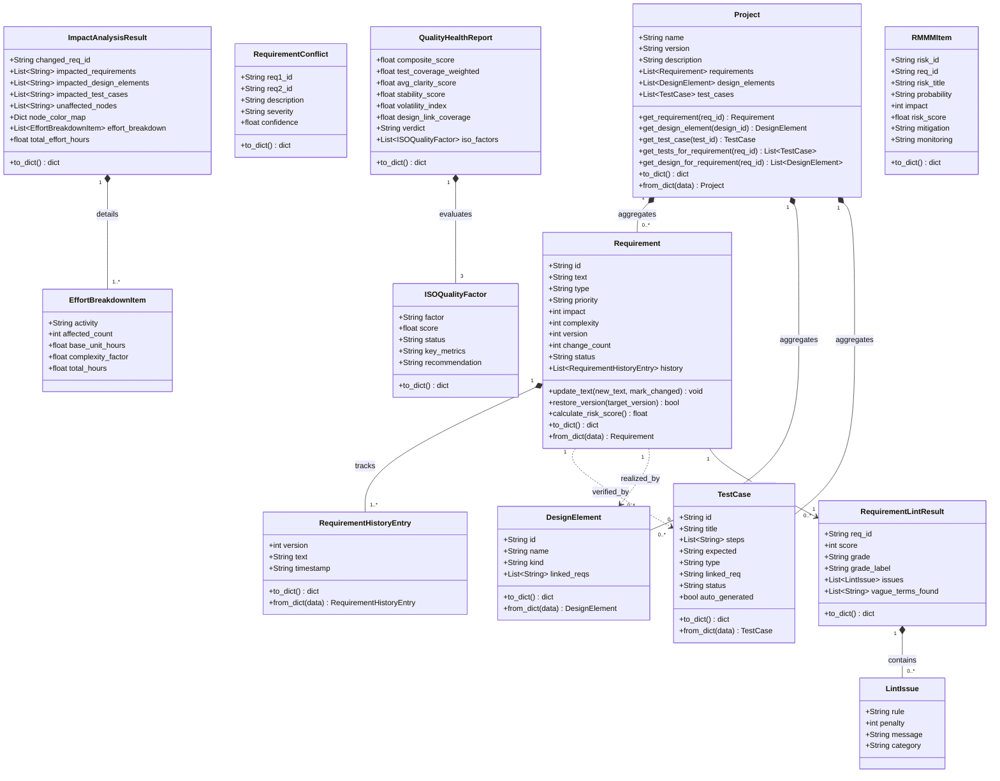

# TraceLens Domain Class Model

This document outlines the core domain entities, data transfer objects, and relationships governing TraceLens.

## Mermaid Class Diagram

```mermaid
classDiagram
    class Project {
        +String name
        +String version
        +String description
        +List~Requirement~ requirements
        +List~DesignElement~ design_elements
        +List~TestCase~ test_cases
        +get_requirement(req_id) Requirement
        +get_design_element(design_id) DesignElement
        +get_test_case(test_id) TestCase
        +get_tests_for_requirement(req_id) List~TestCase~
        +get_design_for_requirement(req_id) List~DesignElement~
        +to_dict() dict
        +from_dict(data) Project
    }

    class Requirement {
        +String id
        +String text
        +String type
        +String priority
        +int impact
        +int complexity
        +int version
        +int change_count
        +String status
        +List~RequirementHistoryEntry~ history
        +update_text(new_text, mark_changed) void
        +restore_version(target_version) bool
        +calculate_risk_score() float
        +to_dict() dict
        +from_dict(data) Requirement
    }

    class RequirementHistoryEntry {
        +int version
        +String text
        +String timestamp
        +to_dict() dict
        +from_dict(data) RequirementHistoryEntry
    }

    class DesignElement {
        +String id
        +String name
        +String kind
        +List~String~ linked_reqs
        +to_dict() dict
        +from_dict(data) DesignElement
    }

    class TestCase {
        +String id
        +String title
        +List~String~ steps
        +String expected
        +String type
        +String linked_req
        +String status
        +bool auto_generated
        +to_dict() dict
        +from_dict(data) TestCase
    }

    class RequirementLintResult {
        +String req_id
        +int score
        +String grade
        +String grade_label
        +List~LintIssue~ issues
        +List~String~ vague_terms_found
        +to_dict() dict
    }

    class LintIssue {
        +String rule
        +int penalty
        +String message
        +String category
    }

    class RequirementConflict {
        +String req1_id
        +String req2_id
        +String description
        +String severity
        +float confidence
        +to_dict() dict
    }

    class ImpactAnalysisResult {
        +String changed_req_id
        +List~String~ impacted_requirements
        +List~String~ impacted_design_elements
        +List~String~ impacted_test_cases
        +List~String~ unaffected_nodes
        +Dict node_color_map
        +List~EffortBreakdownItem~ effort_breakdown
        +float total_effort_hours
        +to_dict() dict
    }

    class EffortBreakdownItem {
        +String activity
        +int affected_count
        +float base_unit_hours
        +float complexity_factor
        +float total_hours
    }

    class QualityHealthReport {
        +float composite_score
        +float test_coverage_weighted
        +float avg_clarity_score
        +float stability_score
        +float volatility_index
        +float design_link_coverage
        +String verdict
        +List~ISOQualityFactor~ iso_factors
        +to_dict() dict
    }

    class ISOQualityFactor {
        +String factor
        +float score
        +String status
        +String key_metrics
        +String recommendation
        +to_dict() dict
    }

    class RMMMItem {
        +String risk_id
        +String req_id
        +String risk_title
        +String probability
        +int impact
        +float risk_score
        +String mitigation
        +String monitoring
        +to_dict() dict
    }

    %% Relationships
    Project "1" *-- "0..*" Requirement : aggregates
    Project "1" *-- "0..*" DesignElement : aggregates
    Project "1" *-- "0..*" TestCase : aggregates
    Requirement "1" *-- "1..*" RequirementHistoryEntry : tracks
    Requirement "1" ..> "0..*" TestCase : verified_by
    Requirement "1" ..> "0..*" DesignElement : realized_by
    Requirement "1" --> "1" RequirementLintResult : produces
    RequirementLintResult "1" *-- "0..*" LintIssue : contains
    ImpactAnalysisResult "1" *-- "1..*" EffortBreakdownItem : details
    QualityHealthReport "1" *-- "3" ISOQualityFactor : evaluates
```
